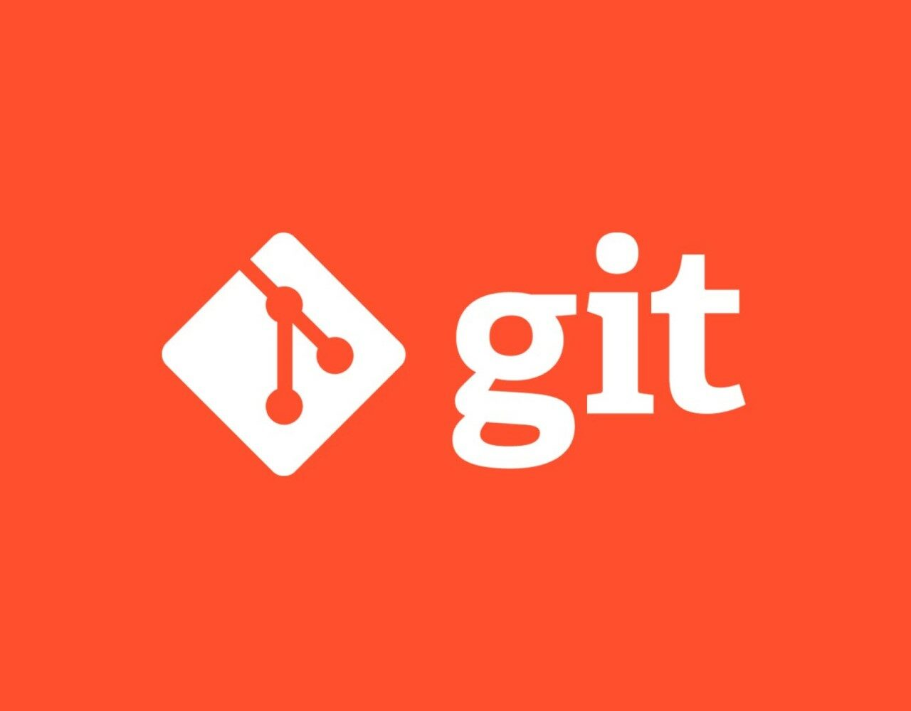

# Работа с Git
## 1. Проверка наличия установленного GIT
Для проверки необходимо в терминале выполнить команду 'git version'

Если Git установлен, появиться сообщение с информацией о версии программы. Иначе будет сообщение об ошибке

## 2. Установка Git 
Загружаем последнюю версию Git с сайта git-scm.com 
устанавливаем с настройками по умолчанию

## 3. Настройка Git
При первом использовании Git необходимо представиться. Для этого  в терминале надо выполнить 2 команды:

```
git config --global user.name «Ваше имя английскими буквами»
git config --global user.email ваша почта@example.com
```

## 4. Иницициализация репозитория
Получить можно 2 способами.
1. в терминале переходим в папке, в которой хотим создать репозиторий. Выполняем команду: 
```
git init
```
2. Клонировать существующий репозиторий Git из любого места. Сделать это можно так:
```
git clone <адрес репозитория>
```

## 5. Запись изменений в репозиторий
Жизненный цыкл состояния файла выглядит так:

Основной инструмент, используемый для определения, какие файлы в каком состоянии находятся — это команда:

```
git status
```
Для того чтобы начать отслеживать (добавить под версионный контроль) новый файл, используется команда 
```
git add <название файла>
git add .
```
Последняя команда используется для добавления всех файлов в текущей папке

Далее мы фиксируем все изменения, создав очередной соммит
```
git commit -m “создание коммита”    
```
Изменив аргумент на **-am** мы объединяем 2 команды, добавляя функционал **add**.

 Иногда полезно посомтреть разницу между коммитами и тут нам на помощь придёт новая команда
```
git diff
```
которая выведет построчно отличия между коммитами

## 6. Просмотр истории Commit
После того, как вы создали несколько коммитов или же клонировали репозиторий с уже существующей историей коммитов, вероятно вам понадобится возможность посмотреть что было сделано — историю коммитов. Одним из основных и наиболее мощных инструментов для этого является команда **git log.**

По умолчанию (без аргументов) git log перечисляет коммиты, сделанные в репозитории в обратном к хронологическому порядке — последние коммиты находятся вверху. 

Самый распространённый аргумент это - *-oneline* - он сокращает до минимума вывод информации, что позволяет удобно перемещаться по большим спискам

Но также может быть полезна при поиске более обширная команда, такая как
```
git log --oneline --all --graph
```

## 7. Перемещение между сохранениями
Команда __git checkout [краткое название hash или полное]__ – переход от одного коммита к другому, позволяет перемещаться между коммитами. В дальнейшем именно это и позволит нам создавать разветвлённую сеть веток проекта. 
```
git checkout [<branch>/commit]
```

 Необходимо возвращаться в актуальное состояние после перемещения по коммитам, используя эту же команду, например, с параметром названия основной ветки "master"

Для всего вышеописанного можно и лучше бы использовать и команду **git switch**, так как Git checkout – это старая команда, которая использовалась для создания и переключения веток + также может использоваться для восстановления изменений с определенного коммита +
позволяет копировать файлы из любой ветки или коммита прямо в ваше рабочее дерево, не переключая ветки.

Поэтому с выходом Git 2.23 его разработчики представили две новые команды git: git switch и git restore.

Идея этого шага заключается в том, чтобы позволить людям использовать git switch для переключения веток, а git restore – для отмены изменений после коммита.

 ДОПОЛНИТЕЛЬНАЯ ФУНКЦИЯ: помимо перехода по ветках и коммитам с помощью этой функции можно создать и переместиться по ветке используя параметр __-b__
 ```
 git checkout -b NewName
 ```


## 8. Игнорирование файлов
Для того, чтобы исключить из отслеживания в репозитории файлы и папки, необходимо создать там файл ***.gitignore*** и записать в него их названия или шаблон, соответсвующий таким файлам и папкам.

К шаблонам в файле ***.gitignore*** применяются следующие правила:
* Пустые строки, а также строки, начинающиеся с #, игнорируются.
* Стандартные шаблоны являются глобальными и применяются рекурсивно для всего дерева каталогов.
* Чтобы избежать рекурсии используйте символ слеш (/) в начале шаблона.
* Чтобы исключить каталог добавьте слеш (/) в конец шаблона.
* Можно инвертировать шаблон, использовав восклицательный знак (!) в качестве первого символа.


## 9. Создание веток Git
Ветка в Git - это простой перемещаемый указатель на один из коммитов, обычно последний в цепочке коммитов.
По умолчанию имя основной ветки в Git - Master 
Создать ветку можно командой
```
git branch <имя новой ветки>
```
В результате создатся новый указатель на созданную ветку
Для переключения на существующую ветку выполните команду 
```
git checkout.
```

## 10. Cлияние веток и разрешение конфликтов
Слияние веток осуществляется командой **merge**. Например,
```
$ git checkout master
$ git merge hotfix
Updating f42c576..3a0874c
Fast-forward
 index.html | 2 ++
 1 file changed, 2 insertions(+)
```
Git переместил указатель ветки вперед, потому что коммит в примере, на который указывает слитая ветка hotfix, был прямым потомком другого более раннего коммита, на котором вы находились до этого. Другими словами, если коммит сливается с тем, до которого можно добраться двигаясь по истории прямо, Git упрощает слияние просто перенося указатель ветки вперед, так как нет расхождений в изменениях. Это называется «fast-forward».

Теперь ваши изменения включены в коммит, на который указывает ветка master, и исправление можно внедрять.

Иногда процесс не проходит гладко. Если вы изменили одну и ту же часть одного и того же файла по-разному в двух объединяемых ветках, Git не сможет их чисто объединить.
Git в таком случае предложит на выбор или сохранить текущую версию, или выбрать для сохранение новую, или же оставить обе в текущем проекте. Выбор всегда за Вами...

Но не забываем сделать коммит слияния после разрешения конфликта

ВАЖНО: если что-то пошло не так, всегда можно откатить 
```
git reset --abort
или 
git reset --merge
```


## 11. Удаление веток
Если все изменения слиты, то можно удалить ветку
```
git branch -d <название ветки>
```
Если нет слитых, то нужно выполнить слияние, а затем потворить команду выше или же принудительно удалить. Если же слито не полностью, но оставшееся по каким то причинам уже не нужно то параметр для удаления используется __-D__ . По другому это можно назвать "принудительное удаление.


## 12. Работа с удалёнными репозиториями
На GitHub можно присоедениться к проекту, сделать Fork (копию чужого репозитория). И далле предлагать изменения владельцу. Но сначала давайте рассмотрим более общий случай.

Cоздайте новый репозиторий в командной строке или закачайте существующий репозиторий из командной строки
```
git remote add original https://github.com/evgeniyvspb/FinalGit.git
git branch -M main
git push -u origin main
```
К сожалению, последний этап у новых пользователей не получиться и его придёться повторить после идентификации. А именно, вот что нужно сделать:
1. после нажатия этой команды GitHub предложит несколько вариантов авторизации, выберем для примера авторизацию через введение кода. Код нужно ввести перейдя по ссылке в том же сообщении с кодом


2. Введя код, GitHub предложит подтвердить Ваше намерение. Если это Вы или тот, кому Вы доверяете, то смело нажимаем на зелёную кнопку


3. После подтверждения паролем в итоге Вы должны получить красивое изображение о том, что всё прошло отлично


### Основные команды, которые понадобяться для удалённой работы:

 - git clone  - она не только
загружает все изменения, но и пытается слить 
все ветки на локальном компьютере и в
удаленном репозитории
 - git pull Эта команда позволяет скачать все 
из текущего репозитория и автоматически
сделать merge с нашей версией
 - git push Отправить свою версию репозитория во
внешний репозиторий поможет команда git
push. При первом её использовании нужна авторизация
 - pull request  это команда для предложения изменений или запрос на вливание изменений в репозиторий
Как было сказано в начале главы, обычно сначалаg один ответственный за проект создает аккаунт. Другие пользователи дают команду pull request. Предлагать изменения на GitHub нужно в отдельной ветке. Сначала пользователь копирует репозиторий на свой компьютер, делает fork репозитория, затем клонирует версию на своём ПК, создаёт ветку с предлагаемыми изменениями, отправляет изменения командой push в свой аккаунт на GitHub и даёт команду pull request.

ВАЖНО: почти все описанные команды и действия можно проделать с помощью мыши. Например, склонировать проект можно просто нажав пару кликов мыши сюда


